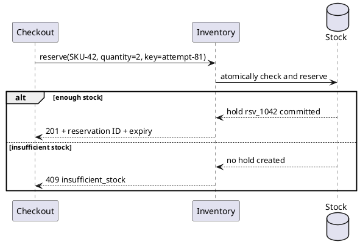

# Choose a notation that answers the question

Use ordinary HTML prose, lists, and tables by default. Add a diagram when the relationship is harder to follow in sentences. Not every section needs one, and no notation proves that a business rule or process is correct.

| Question | Recommended representation | Why / boundary |
| --- | --- | --- |
| What are the few boundaries along this path? | Native HTML flow | Readable, selectable, responsive text; best for a small linear explanation rather than formal branching. |
| Who calls whom, in what order, and what comes back? | PlantUML sequence | Participants, request/response arrows, alternative outcomes, and ordering are explicit. |
| Which states and transitions are allowed? | PlantUML state | Makes lifecycle changes visible; accompany guards and edge cases with prose or a rule table. |
| Which services or concepts relate to each other? | PlantUML component or class | Useful for boundaries and relationships, not as a substitute for an API/data contract. |
| How does an algorithm branch? | PlantUML activity | Compact control flow when business-process message and event semantics are unnecessary. |
| Who performs work, waits, exchanges messages, or handles a timer? | BPMN | Tasks, participants, gateways, and events carry process meaning. Use the symbols deliberately. |
| Which input combination determines an outcome? | HTML decision table | Often clearer than a dense graph of branches; specify hit policy and boundary values. |

## Document workflow

The CLI contract is:

```text
node scripts/document.mjs create <directory> --title <title> --lang ru|en --preset explainer|process|integration
node scripts/document.mjs build <directory> --out <report.html>
```

For example, from the installed skill directory:

```sh
node scripts/document.mjs create ./exchange-guide --title "Reservation exchange" --lang en --preset integration
node scripts/document.mjs build ./exchange-guide --out ./exchange-guide.html
```

Creation produces `document.json`, `content.html`, and `diagrams/`. Put introduction paragraphs and top-level sections with `h2` headings in `content.html`; omit the shell, CSS, scripts, `h1`, navigation, and manual TOC. The builder supplies those. Asset resolution uses the installed skill directory, not the workspace. When invoking from elsewhere, use the installed path to `scripts/document.mjs`.

Save the following PlantUML example as `exchange-guide/diagrams/exchange.puml`, and put this exact source-figure form inside a section in `content.html`:

```html
<figure data-diagram="plantuml" data-source="diagrams/exchange.puml">
  <figcaption>Request and response, including the rejection path.</figcaption>
</figure>
```

Paths are relative to the document workspace and must stay inside it. Keep build output separate from source HTML, metadata, and diagram files. Do not put raw SVG, rendered-image URLs, or renderer scripts into the figure.

PlantUML renders during the build; BPMN is validated/laid out in Node and rendered by an embedded viewer in the reader browser. Both paths sanitize and namespace SVG and use a keyboard-focusable local scroll wrapper with expandable escaped source. The result remains a standalone offline page, but BPMN needs reader JavaScript. The original `.puml` and `.bpmn` files remain editable. No public server or runtime downloads are required. Toolkit setup installs npm packages only, not Java or Chromium. Missing or unsupported tooling must be surfaced rather than bypassed with a remote renderer.

## PlantUML: show the interaction



Name arrows with the action or message, not merely “calls.” Use `alt` for distinct outcomes and dashed return arrows for responses when that distinction helps. The figure above intentionally omits authentication and event publication; describe those separately if the reader needs them. The source represents the required atomic stock operation, not proof of how a database implements it.

Keep PlantUML source self-contained. Do not use remote or local includes, external images, or preprocessors that read files or execute commands. Use the renderer's shared compact monochrome styling instead of copying a new style system into every diagram. Split an unreadably large interaction into focused figures with captions identifying their scope.

## BPMN: show process semantics

Use the same figure contract with BPMN XML:

```html
<figure data-diagram="bpmn" data-source="diagrams/reservation.bpmn">
  <figcaption>Inventory receives a reservation request, checks stock, and ends the request handling.</figcaption>
</figure>
```

This small editable process can be saved as `diagrams/reservation.bpmn` inside the document workspace. It deliberately models only one participant and omits decision and message detail:

```xml
<?xml version="1.0" encoding="UTF-8"?>
<bpmn:definitions xmlns:bpmn="http://www.omg.org/spec/BPMN/20100524/MODEL"
                  id="ReservationDefinitions"
                  targetNamespace="urn:example:reservation">
  <bpmn:process id="ReservationProcess" name="Handle a reservation request" isExecutable="false">
    <bpmn:startEvent id="RequestReceived" name="Request received">
      <bpmn:outgoing>ToCheck</bpmn:outgoing>
    </bpmn:startEvent>
    <bpmn:task id="CheckStock" name="Check available stock">
      <bpmn:incoming>ToCheck</bpmn:incoming>
      <bpmn:outgoing>ToEnd</bpmn:outgoing>
    </bpmn:task>
    <bpmn:endEvent id="CheckFinished" name="Stock check completed">
      <bpmn:incoming>ToEnd</bpmn:incoming>
    </bpmn:endEvent>
    <bpmn:sequenceFlow id="ToCheck" sourceRef="RequestReceived" targetRef="CheckStock" />
    <bpmn:sequenceFlow id="ToEnd" sourceRef="CheckStock" targetRef="CheckFinished" />
  </bpmn:process>
</bpmn:definitions>
```

For supported simple processes without BPMN DI (diagram layout), the renderer adds layout and retains laid-out XML when available. For collaborations, lanes, and more complex cases, supply explicit DI from a BPMN editor; do not assume auto-layout supports every model. An unsupported or incomplete layout should produce an actionable error, not a diagram with missing participants. XML must not contain DOCTYPE or entity declarations.

When extending the process:

- Name tasks with verbs and objects: “Check available stock,” not “Inventory.”
- Use sequence flows for work order within a participant; use message flows between participants, not across lanes in the same pool.
- Label exclusive-gateway branches with mutually exclusive conditions and identify a default where needed. A parallel gateway means concurrency, not a choice.
- Use a timer event only when time changes process behavior; distinguish an interrupting timeout from a non-interrupting reminder.
- Use lanes for responsibility, not merely decorative grouping. An end event ends the modeled path; it does not automatically mean the business request succeeded.

## Native flow: keep a simple explanation simple

Copy `assets/components/native-flow.html` for a four-boundary path using the theme's `.diagram`, `.flow`, `.node`, and `.connector` classes. Keep node text in HTML, connector labels meaningful, decorative arrows `aria-hidden`, and the figure tied to its caption. The theme stacks the path on narrow screens. No `data-diagram` or source file is necessary for this form.

Use an ordered list instead if the nodes are simply steps by one actor. Move to PlantUML or BPMN when branches, cycles, event timing, or message semantics would otherwise require invented arrow conventions or a complicated custom HTML graph.

## Reading and checking diagrams

Give every figure a caption explaining what to notice, where the modeled boundary is, and any relevant omission. Keep names and outcomes consistent with the adjacent scenario, glossary, decision table, and API contract. Do not rely on color alone to distinguish success from rejection.

After editing, parse/build and inspect the rendered figure for readable labels, intact connectors, local scrolling, and escaped source. A successful render is syntax/presentation evidence only. Domain validity, rule coverage, race behavior, and operational feasibility remain separate questions; do not claim logical proof or add an approval gate merely because a diagram exists.
