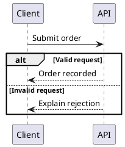

# Local rendering and setup

## What runs where

Authoring uses Node 22.12+ and pinned npm packages. No Java, Chromium, native Graphviz or browser executable is required for any build. PlantUML becomes static SVG during the build; BPMN XML is validated/laid out in Node and rendered by embedded bpmn-js when the reader opens the HTML in an ordinary browser. The complete HTML works offline: CSS, navigation, supported local raster images, the BPMN renderer/sanitizer and sources are inline, with no CDN or server. Local images do not create reader network dependencies. BPMN requires reader JavaScript; the document text, PlantUML and downloadable diagram sources do not.

Setup is the only online step:

```sh
node /path/to/skill/scripts/setup.mjs
node /path/to/skill/scripts/document.mjs doctor
```

For authoring, `--npm` is equivalent to the default setup. Only maintainers running browser tests need the explicit second command:

```sh
node /path/to/skill/scripts/setup.mjs --npm
node /path/to/skill/scripts/setup.mjs --npm --browser # optional development/test tools
```

The npm lockfile pins tooling and package integrity hashes, including `@plantuml/mcp-js@0.2.2` and `@viz-js/viz@3.28.0`. We import only the bundled TeaVM `engine.js`, not the package's MCP server. There is no MCP service to configure or start. Default setup installs production dependencies only. Playwright/Chromium are optional development tools, not build dependencies. Installed files remain ignored under `.tools/` and `node_modules/`. BPMN HTML embeds only the production viewer, DOMPurify, the reader adapter and license notices—not Node, Playwright, a browser binary or the PlantUML engine. Documents without BPMN do not include these browser renderer bundles.

There is no Java or headless-browser fallback. Doctor checks build dependencies without inspecting a browser cache. A previously downloaded toolkit-local `.tools/ms-playwright/` can be removed if you do not run browser tests; setup does not delete existing development caches. `BPMN_CHROMIUM_EXECUTABLE` is obsolete; `PLAYWRIGHT_BROWSERS_PATH` is only relevant to development tests. Setup never installs operating-system packages or escalates privileges.

## PlantUML

Source files use `.puml` with exactly one `@startuml` / `@enduml` block. The renderer owns monochrome styling and uses Viz.js WASM where Graphviz layout is required. No system Graphviz is needed for the tested diagram families: sequence, state, activity, use case, component, deployment and entity relationships.



The safe source subset deliberately excludes preprocessors/includes, built-in functions, image directives, custom skin/style/layout replacement, multiple diagrams and pagination. The conservative scanner also applies to comments and quoted text; avoid directive-like text or exclamation marks in labels. These are toolkit limits, not a claim that PlantUML itself lacks those features. Keep explanation in document prose when a label would require excluded syntax.

Execution uses a cancellable Node worker thread with bounded time/memory/output, restricted source syntax and blocked network APIs. No Java process, shell, public renderer or runtime download is used. Input is limited to 256 KiB; generated SVG to 8 MiB. Syntax errors and renderer error images are failures, not successful diagrams. The editable source embedded in the report remains the author's original input, not the injected styling.

## BPMN

Sources are actual `.bpmn` BPMN 2.0 XML, not a custom flow language. Build-time preparation validates XML and DI without a browser. At reading time, the embedded bpmn-js viewer creates SVG locally; a bundled adapter sanitizes and isolates it before display. No source is uploaded or fetched. The toolkit does not execute tasks, scripts, timers or processes.

Missing DI is automatically laid out only for a supported single process. Include correct incoming/outgoing sequence-flow references. The renderer rejects auto-layout for collaborations, pools/participants, lanes, subprocesses, message flows, data objects and other unsupported constructs rather than silently removing them. Supply complete explicit BPMN DI for advanced models. The retained/downloadable generated XML includes auto-layout DI; the original source file is not rewritten.

The explicit-DI fixtures under `tests/fixtures/bpmn/` demonstrate notation beyond the simple auto-layout process. Imported elements must actually appear in the rendered diagram. Missing shapes, hidden subprocess contents, incomplete DI, import warnings and multiple diagrams are diagnosed instead of being treated as success. This strictness favors faithful documentation over partial previews.

BPMN source is limited to 2 MiB and 10,000 XML elements; output to 8 MiB. DOCTYPE/entity declarations are refused. Auto-layout runs in a cancellable worker thread. Monochrome rendering retains BPMN task, gateway and event markers; it does not replace them with generic boxes.

## Authored local raster images

Local raster images are optional ordinary content. The author creates the document's `images/` directory only when needed and keeps the editable files beside `content.html`; the authoring markup and accessibility rules are in [authoring.md](authoring.md). PNG, JPEG (`.jpg`, `.jpeg`) and WebP are supported. SVG and GIF are not supported as authored content images; rendered diagram SVG continues to use its existing PlantUML/BPMN contract.

At build time, the original image bytes are embedded as a `data:image/...;base64,...` URL with intrinsic dimensions for responsive, uncropped display. The reader does not fetch the image or need a network. The input path and any symlink must resolve within the document directory, and the output cannot overwrite an image source. Limits are 8 MiB, 40 million pixels and 65,535 pixels per axis for each still image, plus 32 MiB of raw image bytes and 80 million pixels per document, counting every occurrence. Animated PNG/WebP and multi-image JPEG are rejected. Metadata/EXIF is not stripped. Format/header checks are not a full pixel decoder.

Remote or data URLs as an authored `src`, `srcset`, `style`, `onload`, and arbitrary `<iframe>`/HTML embedding remain forbidden. These rules apply to authored raster images; the PlantUML and BPMN diagram contracts above are unchanged.

## Safe embedding and source retention

PlantUML SVG is sanitized during the build; BPMN SVG is sanitized in the reader. Both paths namespace IDs/local references, add accessible titles, and use keyboard-focusable local scroll regions. Scripts, event handlers, foreign objects, embedded image resources and remote references remain forbidden inside rendered diagram SVG. PlantUML renderer styles are flattened into SVG-local declarations; BPMN's generated SVG is restricted to safe local presentation so it cannot alter the document theme. The fixed legacy SVG doctype emitted by bpmn-js is stripped before parsing; arbitrary doctypes/entities remain forbidden.

Diagram sources are escaped text in a native disclosure and can be downloaded offline. Source links use embedded `data:text/plain` URLs; no source file needs to be fetched when reading the report. A figure caption should explain the diagram's interpretation and limits, not merely give it a number.

## Reader states and printing

BPMN figures initially show a localized status, then the diagram or an explicit error. If JavaScript is disabled, a visible explanation and the original source remain available; there is no pre-rendered BPMN image fallback. Wait until diagrams appear before printing. Native Ctrl+P cannot be made to await an asynchronous Promise; pending/error text remains visible in print rather than silently omitting a diagram. Automated exports can await `window.bpmnDiagramsReady` and require every result's `ok` to be true before printing.

## Troubleshooting

| Symptom | Action |
| --- | --- |
| Missing npm module | Run `setup.mjs --npm` in the installed toolkit. |
| PlantUML JS engine unavailable | Run `setup.mjs --npm`. Java and `JAVA_BIN`/`PLANTUML_JAR` are no longer used. |
| BPMN loading/error in the reader | Enable JavaScript and inspect the visible error/source. Rebuild with current toolkit; no browser installation is needed on the authoring machine. |
| Maintainer browser test unavailable | Explicitly run `setup.mjs --npm --browser`; check Playwright host support. |
| PlantUML unsafe directive | Remove includes/functions/styles; use the shared rendering policy. |
| BPMN missing DI / unrendered elements | Supply complete explicit DI or simplify to a supported single-process model. |
| Diagram timeout | Reduce diagram scope; split independent questions into separate figures. |
| Failed build | Read the source-prefixed error; the prior HTML remains unchanged. |

A successful render checks syntax, supported layout and safe embedding. It cannot establish that the model accurately represents an organization's business process or that an integration implementation meets its contract.
