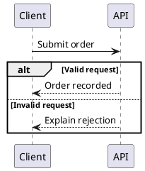

# Local rendering and setup

## What runs where

Authoring uses Node 22.12+, the pinned PlantUML JavaScript engine with Viz.js WASM for UML, and local Playwright Chromium plus bpmn-js for BPMN. No JRE, JAR, system Java or native Graphviz is needed. The finished HTML embeds CSS, navigation JS and static SVG. Reading needs no Node, Java, browser extension, server, public renderer or network connection.

Setup is the only online step:

```sh
node /path/to/skill/scripts/setup.mjs
node /path/to/skill/scripts/document.mjs doctor
```

You can install in parts:

```sh
node /path/to/skill/scripts/setup.mjs --npm
node /path/to/skill/scripts/setup.mjs --browser
```

The npm lockfile pins tooling and package integrity hashes, including `@plantuml/mcp-js@0.2.2` and `@viz-js/viz@3.28.0`. We import only the bundled TeaVM `engine.js`, not the package's MCP server. There is no MCP service to configure or start. `setup.mjs --npm` is sufficient for PlantUML; Chromium is needed only for BPMN. Playwright manages its pinned Chromium revision. Downloaded tools and npm modules stay ignored under `.tools/` and `node_modules/`; they are not embedded into the reader's HTML.

There is no Java installation step or Java fallback. The BPMN browser requires a Playwright-supported OS and its normal system libraries. The renderer resolves Playwright's platform/revision-specific executable in the local toolkit cache; set `PLAYWRIGHT_BROWSERS_PATH` to a custom cache directory or `BPMN_CHROMIUM_EXECUTABLE` to an explicit local executable when needed. Setup does not install operating-system packages or escalate privileges. Doctor reports installation presence; real renderer tests verify operation.

## PlantUML

Source files use `.puml` with exactly one `@startuml` / `@enduml` block. The renderer owns monochrome styling and uses Viz.js WASM where Graphviz layout is required. No system Graphviz is needed for the tested diagram families: sequence, state, activity, use case, component, deployment and entity relationships.



The safe source subset deliberately excludes preprocessors/includes, built-in functions, images, custom skin/style/layout replacement, multiple diagrams and pagination. The conservative scanner also applies to comments and quoted text; avoid directive-like text or exclamation marks in labels. These are toolkit limits, not a claim that PlantUML itself lacks those features. Keep explanation in document prose when a label would require excluded syntax.

Execution uses a cancellable Node worker thread with bounded time/memory/output, restricted source syntax and blocked network APIs. No Java process, shell, public renderer or runtime download is used. Input is limited to 256 KiB; generated SVG to 8 MiB. Syntax errors and renderer error images are failures, not successful diagrams. The editable source embedded in the report remains the author's original input, not the injected styling.

## BPMN

Sources are actual `.bpmn` BPMN 2.0 XML, not a custom flow language. bpmn-js imports and exports SVG locally in a headless browser with requests blocked. The toolkit does not execute tasks, scripts, timers or processes.

Missing DI is automatically laid out only for a supported single process. Include correct incoming/outgoing sequence-flow references. The renderer rejects auto-layout for collaborations, pools/participants, lanes, subprocesses, message flows, data objects and other unsupported constructs rather than silently removing them. Supply complete explicit BPMN DI for advanced models. The retained/downloadable generated XML includes auto-layout DI; the original source file is not rewritten.

The explicit-DI fixtures under `tests/fixtures/bpmn/` demonstrate notation beyond the simple auto-layout process. Imported elements must actually appear in the rendered diagram. Missing shapes, hidden subprocess contents, incomplete DI, import warnings and multiple diagrams are diagnosed instead of being treated as success. This strictness favors faithful documentation over partial previews.

BPMN source is limited to 2 MiB and 10,000 XML elements; output to 8 MiB. DOCTYPE/entity declarations are refused. Auto-layout runs in a cancellable worker thread. Monochrome rendering retains BPMN task, gateway and event markers; it does not replace them with generic boxes.

## Safe embedding and source retention

The builder sanitizes renderer SVG, namespaces every ID and its local references, gives it an accessible title, and places it in a keyboard-focusable local scroll region. Scripts, event handlers, foreign objects, image resources and remote references are forbidden. Renderer styles are flattened into SVG-local declarations so they cannot alter the document theme. The fixed legacy SVG doctype emitted by bpmn-js is stripped before parsing; arbitrary doctypes/entities remain forbidden.

Diagram sources are escaped text in a native disclosure and can be downloaded offline. Source links use embedded `data:text/plain` URLs; no source file needs to be fetched when reading the report. A figure caption should explain the diagram's interpretation and limits, not merely give it a number.

## Troubleshooting

| Symptom | Action |
| --- | --- |
| Missing npm module | Run `setup.mjs --npm` in the installed toolkit. |
| PlantUML JS engine unavailable | Run `setup.mjs --npm`. Java and `JAVA_BIN`/`PLANTUML_JAR` are no longer used. |
| Browser unavailable | Run `setup.mjs --browser`; check OS/library support. |
| PlantUML unsafe directive | Remove includes/functions/styles; use the shared rendering policy. |
| BPMN missing DI / unrendered elements | Supply complete explicit DI or simplify to a supported single-process model. |
| Diagram timeout | Reduce diagram scope; split independent questions into separate figures. |
| Failed build | Read the source-prefixed error; the prior HTML remains unchanged. |

A successful render checks syntax, supported layout and safe embedding. It cannot establish that the model accurately represents an organization's business process or that an integration implementation meets its contract.
